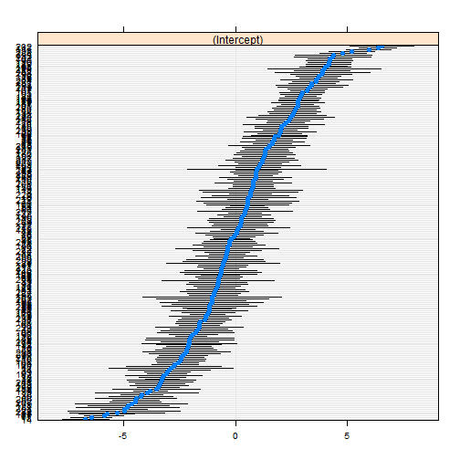
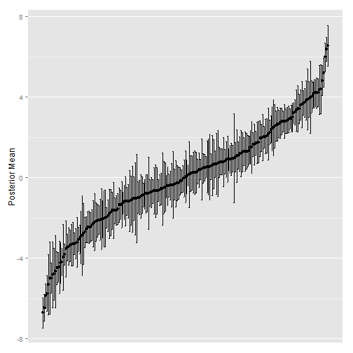

Chapter 4: The Random Intercept Model
===============================================================================


```r
library(lme4)
library(ggplot2)
library(dplyr)

varcomp <- function(obj) {
  components <- unlist(lapply(VarCorr(obj), diag))
  residual <- attr(VarCorr(obj), "sc")
  variance_components <- c(components, Residual = residual ^ 2)
  ICC <- components / sum(variance_components)
  list(var.components = variance_components, ICC = ICC)
}

# Access and pretty print a fixed effect coefficient
fixef2 <- function(model, variable) round(fixef(model)[variable], 2)

# Load data
d <- read.table("mlbook2_r.dat", header = TRUE)
str(d)
```

```
## 'data.frame':	3758 obs. of  11 variables:
##  $ schoolnr   : num  1 1 1 1 1 1 1 1 1 1 ...
##  $ pupilNR_new: num  3 4 5 6 7 8 9 10 11 12 ...
##  $ langPOST   : num  46 45 33 46 20 30 30 57 36 36 ...
##  $ ses        : num  -4.73 -17.73 -12.73 -4.73 -17.73 ...
##  $ IQ_verb    : num  3.13 2.63 -2.37 -0.87 -3.87 -2.37 -2.37 1.13 -2.37 -0.87 ...
##  $ sex        : num  0 0 0 0 0 0 0 0 0 0 ...
##  $ Minority   : num  0 1 0 0 0 1 1 0 1 1 ...
##  $ denomina   : num  1 1 1 1 1 1 1 1 1 1 ...
##  $ sch_ses    : num  -14 -14 -14 -14 -14 ...
##  $ sch_iqv    : num  -1.4 -1.4 -1.4 -1.4 -1.4 ...
##  $ sch_min    : num  0.63 0.63 0.63 0.63 0.63 0.63 0.63 0.63 0.63 0.63 ...
```


Ex. 4.1: Empty model for language scores in elementary schools
-------------------------------------------------------------------------------


```r
m_1 <- lmer(langPOST ~ 1 + (1 | schoolnr), d, REML = FALSE)
summary(m_1)
```

```
## Linear mixed model fit by maximum likelihood ['lmerMod']
## Formula: langPOST ~ 1 + (1 | schoolnr) 
##    Data: d 
## 
##      AIC      BIC   logLik deviance 
##    26601    26620   -13298    26595 
## 
## Random effects:
##  Groups   Name        Variance Std.Dev.
##  schoolnr (Intercept) 18.1     4.26    
##  Residual             62.9     7.93    
## Number of obs: 3758, groups: schoolnr, 211
## 
## Fixed effects:
##             Estimate Std. Error t value
## (Intercept)   41.005      0.325     126
```


> For the overall distribution of the language scores, these estimates provide a mean of 41.00 and a standard deviation of 9.00 = `sqrt(18.12 + 62.85)` [i.e., the square-root of the variances in the random effects]. The mean of 41.00 should be interpreted as the expected value of the language score for a random pupil in a randomly drawn class. This is close, but not identical, to the raw mean 41.41 and standard deviation 8.89. (p. 51)


Ex. 4.2: Random intercept and one explanatory variable (IQ)
-------------------------------------------------------------------------------

> The random variables <em>U</em><sub>0<em>j</em></sub> can be regarded as residuals are the group level, or group effects that are left unexplained by _X_. Since residuals, or random errors, contain those parts of the variability of the dependent variable that are not modeled explicitly as a function of explanatory variables, this model contains unexplained variability at two nested levels. This partition of unexplained variability over the various levels is the essense of hierarchical random effects models. (p. 51)


```r
m_2 <- lmer(langPOST ~ IQ_verb + (1 | schoolnr), d, REML = FALSE)
summary(m_2)
```

```
## Linear mixed model fit by maximum likelihood ['lmerMod']
## Formula: langPOST ~ IQ_verb + (1 | schoolnr) 
##    Data: d 
## 
##      AIC      BIC   logLik deviance 
##    24920    24945   -12456    24912 
## 
## Random effects:
##  Groups   Name        Variance Std.Dev.
##  schoolnr (Intercept)  9.85    3.14    
##  Residual             40.47    6.36    
## Number of obs: 3758, groups: schoolnr, 211
## 
## Fixed effects:
##             Estimate Std. Error t value
## (Intercept)  41.0549     0.2434   168.7
## IQ_verb       2.5074     0.0544    46.1
## 
## Correlation of Fixed Effects:
##         (Intr)
## IQ_verb 0.003
```

```r
# Get the standard deviation of the random (class-dependent) intercepts
sd_U0j <- attr(VarCorr(m_2)[["schoolnr"]], "stddev")
sd_U0j <- as.numeric(round(sd_U0j, 2))
sd_U0j
```

```
## [1] 3.14
```

```r
fixed_intercept <- round(fixef(m_2)[["(Intercept)"]], 2)
# Adjusted intercept for a high-achieving (+2SD) class
fixed_intercept + 2 * sd_U0j
```

```
## [1] 47.33
```

```r
# Adjusted intercept for a low-achieving (-2SD) class
fixed_intercept - 2 * sd_U0j
```

```
## [1] 34.77
```

```r
# Expect residual intraclass correlation = 0.20
varcomp(m_2)$ICC
```

```
## schoolnr.(Intercept) 
##               0.1957
```


Ex. 4.3: Within- and between-group regressions for IQ
-------------------------------------------------------------------------------

> The within-group regression coefficient expresses the effect of the explanatory variable within a given group; the between-group regression coefficient expresses the effect of the group mean of the explanatory variable on the group mean of the dependent variable. (p. 56)


```r
m_3a <- lmer(langPOST ~ IQ_verb + sch_iqv + (1 | schoolnr), d, REML = FALSE)
summary(m_3a)
```

```
## Linear mixed model fit by maximum likelihood ['lmerMod']
## Formula: langPOST ~ IQ_verb + sch_iqv + (1 | schoolnr) 
##    Data: d 
## 
##      AIC      BIC   logLik deviance 
##    24898    24929   -12444    24888 
## 
## Random effects:
##  Groups   Name        Variance Std.Dev.
##  schoolnr (Intercept)  8.68    2.95    
##  Residual             40.43    6.36    
## Number of obs: 3758, groups: schoolnr, 211
## 
## Fixed effects:
##             Estimate Std. Error t value
## (Intercept)  41.1138     0.2318   177.4
## IQ_verb       2.4536     0.0555    44.2
## sch_iqv       1.3124     0.2616     5.0
## 
## Correlation of Fixed Effects:
##         (Intr) IQ_vrb
## IQ_verb -0.007       
## sch_iqv  0.043 -0.210
```


The within-group effect is the fixed effect of IQ on language, _b_ = 2.45. The between-group effect is the sum of the parameters, _b_ = 2.45 + 1.31 = 3.76. 

> The contextual effect of mean IQ in the class gives an additional contribution over and above the effect of individual IQ. (p. 58) 

The _t_ statistic for the contextual effect tests the null hypothesis that the between-group effect equals 0 (and therefore that there is no difference between within-group and between-group coefficients).

> Classes differ in two ways: they may have different mean IQ values, whichs affects the expected results _Y_ through the term 1.312 * `sch_iqv` [i.e., mean IQ in class _j_]; this is an explained difference between the classes; and they have randomly differing values for <em>U</em><sub>0<em>j</em></sub>, which is an unexplained difference. These two ingredients contribute to the class-dependent intercept, given by 41.11 + <em>U</em><sub>0<em>j</em></sub> + 1.312 * `sch_iqv`. (p. 59)

### Within-group centering


```r
d <- mutate(d, dev_iqv = IQ_verb - sch_iqv)
m_3b <- lmer(langPOST ~ dev_iqv + sch_iqv + (1 | schoolnr), d, REML = FALSE)
summary(m_3b)
```

```
## Linear mixed model fit by maximum likelihood ['lmerMod']
## Formula: langPOST ~ dev_iqv + sch_iqv + (1 | schoolnr) 
##    Data: d 
## 
##      AIC      BIC   logLik deviance 
##    24898    24929   -12444    24888 
## 
## Random effects:
##  Groups   Name        Variance Std.Dev.
##  schoolnr (Intercept)  8.68    2.95    
##  Residual             40.43    6.36    
## Number of obs: 3758, groups: schoolnr, 211
## 
## Fixed effects:
##             Estimate Std. Error t value
## (Intercept)  41.1138     0.2318   177.4
## dev_iqv       2.4536     0.0555    44.2
## sch_iqv       3.7660     0.2558    14.7
## 
## Correlation of Fixed Effects:
##         (Intr) dev_qv
## dev_iqv -0.007       
## sch_iqv  0.042  0.002
```

```r
# Equivalently
m_3c <- lmer(langPOST ~ I(IQ_verb - sch_iqv) + sch_iqv + (1 | schoolnr), d, 
    REML = FALSE)
```


The advantage of within-group centering is that the within-group regression coefficient is now conveniently expressed in the model's fixed effects, _b_ = 3.77.


Ex. 4.6: Comparing added value of schools
-------------------------------------------------------------------------------


```r
# Extract posterior means and variances
random <- ranef(m_3a, condVar = TRUE, drop = TRUE)
random <- random[["schoolnr"]]
post_mean <- as.numeric(random)
post_var <- attr(random, "postVar")

# Generate comparative intervals from comparative SD
comp_sd <- sqrt(post_var)
ci_level <- comp_sd * 1.39

# Dump into a data-frame
emp_bayes <- data.frame(ID = names(random), PostMean = post_mean, PostVar = post_var, 
    Lower = post_mean - ci_level, Upper = post_mean + ci_level)
emp_bayes <- arrange(emp_bayes, PostMean, Lower, Upper)
head(emp_bayes)
```

```
##    ID PostMean PostVar  Lower  Upper
## 1  14   -6.717  0.2861 -7.461 -5.974
## 2  18   -6.470  0.2293 -7.135 -5.804
## 3  67   -5.888  0.2004 -6.510 -5.266
## 4 107   -5.761  0.4015 -6.641 -4.880
## 5  15   -5.317  1.1753 -6.823 -3.810
## 6 232   -4.996  1.6579 -6.785 -3.206
```

```r

## Catepillar plots

# Fast way to make a catepillar plot
dotplot(ranef(m_3a, condVar = TRUE))
```

```
## $schoolnr
```

 

```r
# Plot the estimates collected in the data-frame
ggplot(emp_bayes, aes(x = seq_len(nrow(emp_bayes)), y = PostMean)) + geom_errorbar(aes(ymin = Lower, 
    ymax = Upper)) + geom_point() + labs(x = NULL, y = "Posterior Mean") + theme(axis.ticks.x = element_blank(), 
    axis.text.x = element_blank()) + scale_x_continuous(breaks = NULL)
```

 

```r
## Count how many schools overlap with the lowest and highest schools
lower_bound_of_max <- emp_bayes[which.max(emp_bayes$PostMean), "Lower"]
upper_bound_of_min <- emp_bayes[which.min(emp_bayes$PostMean), "Upper"]

# Subtract one because the highest/lowest schools overlap with themselves
sum(lower_bound_of_max <= emp_bayes$Upper) - 1
```

```
## [1] 7
```

```r
sum(emp_bayes$Lower <= upper_bound_of_min) - 1
```

```
## [1] 8
```

```r
# These counts do not match the textbook...
```


*** 


```r
sessionInfo()
```

```
## R version 3.0.2 (2013-09-25)
## Platform: x86_64-w64-mingw32/x64 (64-bit)
## 
## locale:
## [1] LC_COLLATE=English_United States.1252 
## [2] LC_CTYPE=English_United States.1252   
## [3] LC_MONETARY=English_United States.1252
## [4] LC_NUMERIC=C                          
## [5] LC_TIME=English_United States.1252    
## 
## attached base packages:
## [1] stats     graphics  grDevices utils     datasets  methods   base     
## 
## other attached packages:
## [1] dplyr_0.1.2     ggplot2_0.9.3.1 lme4_1.0-6      Matrix_1.1-2-2 
## [5] lattice_0.20-27 knitr_1.5      
## 
## loaded via a namespace (and not attached):
##  [1] assertthat_0.1     colorspace_1.2-4   dichromat_2.0-0   
##  [4] digest_0.6.4       evaluate_0.5.1     formatR_0.10      
##  [7] grid_3.0.2         gtable_0.1.2       labeling_0.2      
## [10] MASS_7.3-29        minqa_1.2.3        munsell_0.4.2     
## [13] nlme_3.1-111       plyr_1.8.1         proto_0.3-10      
## [16] RColorBrewer_1.0-5 Rcpp_0.11.0        reshape2_1.2.2    
## [19] scales_0.2.3       splines_3.0.2      stringr_0.6.2     
## [22] tools_3.0.2
```

```r
date()
```

```
## [1] "Wed Mar 26 13:29:04 2014"
```


