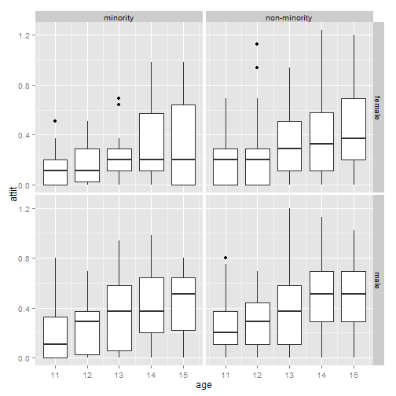
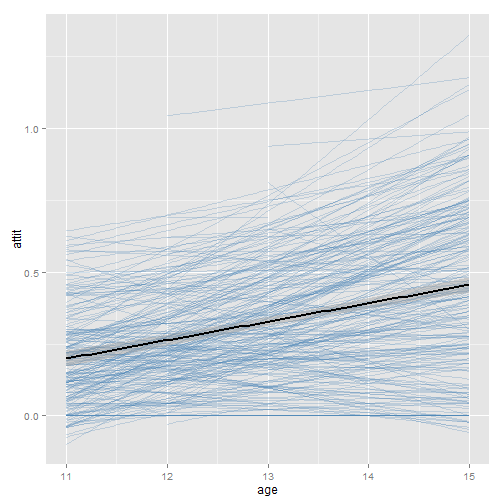
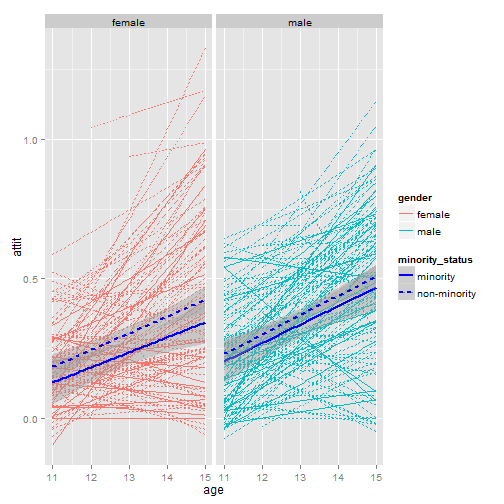
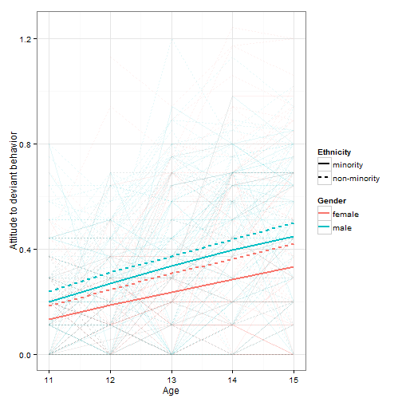

```R
library(psych)
library(nlme)
library(mgcv)
library(multilevel)
library(ggplot2)
library(dplyr)
options(knitr.tidy = FALSE)

cov_matrix2 <- function(lme_model, data = d) {
  block_diagonals <- extract.lme.cov2(lme_model, d)$V
  which_full <- which.max(sapply(block_diagonals, nrow))
  full_cov_mat <- block_diagonals[[which_full]]
  full_cov_mat
}

cov_matrix <- function(gls_model) {
  cor_matrix(gls_model) * sigma_squared(gls_model) * 
    var_estimates(gls_model) %*% t(var_estimates(gls_model))
}

cor_matrix <- function(gls_model) { 
  cor_mat <- corMatrix(gls_model$modelStruct$corStruct)
  which_full <- which.max(sapply(cor_mat, nrow))
  full_cor_mat <- cor_mat[[which_full]]
  full_cor_mat
}

var_estimates <- function(gls_model) {
  coefs <- coef(gls_model$modelStruct$varStruct, 
                unconstrained = FALSE, allCoef = TRUE)
  # Sort by name
  coefs[sort(names(coefs))]
}

sigma_squared <- function(gls_model) gls_model$sigma ^ 2

d <- read.csv("nys.csv")
d <- select(d, -ind1, -ind2, -ind3, -ind4, -ind5)
```


Preliminaries
-------------------------------------------------------------------------------

### Codebook

* `id`: subject ID
* `attit`: attitudes toward deviance (composite score). Larger values imply more tolerance toward deviant behaviors by peers (such as cheating, stealing five dollars, etc.).
* `expo`: exposure to delinquent peers (composite score). Larger values imply more frequent contacts with delinquent peers.
* `age`: age of subject
* `age11`: `age` minus 11
* `age13`: `age` minus 13
* `age11s`: `age11` squared
* `age13s`: `age13` squared
* `ind1`--`ind5`: measurement indicator matrix for HLM7.  Same for `age`, `age11`, `age13`.
* `female`: 1 if female, otherwise 0
* `minority`: 1 if minority, otherwise 0
* `income`: family income categories. Larger values imply higher family income.


### First look at the data

#### Descriptives


```R
head(d)
```

```
##   id attit  expo age age11 age13 age11s age13s female minority income
## 1  3  0.11 -0.37  11     0    -2      0      4      1        0      3
## 2  3  0.20 -0.27  12     1    -1      1      1      1        0      3
## 3  3  0.00 -0.37  13     2     0      4      0      1        0      3
## 4  3  0.00 -0.27  14     3     1      9      1      1        0      3
## 5  3  0.11 -0.17  15     4     2     16      4      1        0      3
## 6  8  0.29  0.42  11     0    -2      0      4      0        0      4
```

```R
as.data.frame(table(table(d$id), dnn = c("ObservationsPerSubject")))
```

```
##   ObservationsPerSubject Freq
## 1                      1    7
## 2                      2    5
## 3                      3   14
## 4                      4   45
## 5                      5  168
```

```R
d$age_group <- paste0("Age_", d$age)
d$gender <- ifelse(d$female, "female", "male")
d$minority_status <- ifelse(d$minority, "minority", "non-minority")
describe_briefly <- function(...) {
  summary <- describeBy(..., digits = 3, mat = TRUE)
  select(summary, -vars, -trimmed, -mad, -min, -max, -item)
}

# Attitude by age, gender, minority, income
describe_briefly(d$attit, group = list(Age = d$age_group))
```

```
##    group1   n  mean    sd median range  skew kurtosis    se
## 11 Age_11 202 0.211 0.186   0.20  0.80 0.795    0.254 0.013
## 12 Age_12 209 0.238 0.211   0.20  1.13 0.910    0.836 0.015
## 13 Age_13 230 0.332 0.270   0.29  1.20 0.509   -0.653 0.018
## 14 Age_14 220 0.410 0.290   0.44  1.24 0.292   -0.632 0.020
## 15 Age_15 218 0.446 0.301   0.44  1.20 0.119   -0.981 0.020
```

```R
describe_briefly(d$attit, group = list(d$age_group, d$gender))
```

```
##     group1 group2   n  mean    sd median range   skew kurtosis    se
## 11  Age_11 female  96 0.185 0.162  0.200  0.69  0.562   -0.270 0.017
## 12  Age_12 female 104 0.206 0.208  0.155  1.13  1.537    3.442 0.020
## 13  Age_13 female 111 0.296 0.253  0.200  0.94  0.647   -0.670 0.024
## 14  Age_14 female 105 0.360 0.308  0.290  1.24  0.767   -0.095 0.030
## 15  Age_15 female 104 0.400 0.324  0.330  1.20  0.502   -0.782 0.032
## 16  Age_11   male 106 0.234 0.203  0.200  0.80  0.783   -0.001 0.020
## 17  Age_12   male 105 0.270 0.209  0.290  0.69  0.342   -0.980 0.020
## 18  Age_13   male 119 0.365 0.282  0.370  1.20  0.360   -0.698 0.026
## 19  Age_14   male 115 0.456 0.266  0.510  1.13 -0.190   -0.848 0.025
## 110 Age_15   male 114 0.487 0.273  0.510  1.02 -0.277   -0.990 0.026
```

```R
describe_briefly(d$attit, group = list(d$age_group, d$minority_status))
```

```
##     group1       group2   n  mean    sd median range  skew kurtosis    se
## 11  Age_11     minority  43 0.176 0.199   0.11  0.80 1.214    0.993 0.030
## 12  Age_12     minority  44 0.208 0.182   0.20  0.69 0.504   -0.666 0.027
## 13  Age_13     minority  48 0.281 0.254   0.20  0.94 0.726   -0.520 0.037
## 14  Age_14     minority  45 0.374 0.291   0.29  0.98 0.392   -1.136 0.043
## 15  Age_15     minority  43 0.389 0.294   0.44  0.98 0.049   -1.360 0.045
## 16  Age_11 non-minority 159 0.220 0.181   0.20  0.80 0.679    0.076 0.014
## 17  Age_12 non-minority 165 0.246 0.218   0.20  1.13 0.935    0.848 0.017
## 18  Age_13 non-minority 182 0.345 0.273   0.29  1.20 0.447   -0.692 0.020
## 19  Age_14 non-minority 175 0.419 0.290   0.44  1.24 0.265   -0.517 0.022
## 110 Age_15 non-minority 175 0.460 0.301   0.44  1.20 0.128   -0.953 0.023
```

```R
describe_briefly(d$attit, group = list(d$income))
```

```
##     group1   n  mean    sd median range  skew kurtosis    se
## 11       1 115 0.295 0.260   0.29  0.94 0.426   -1.019 0.024
## 12       2 209 0.378 0.312   0.29  1.20 0.607   -0.537 0.022
## 13       3 185 0.292 0.251   0.20  0.98 0.606   -0.655 0.018
## 14       4 168 0.359 0.307   0.29  1.24 0.512   -0.747 0.024
## 15       5 136 0.345 0.257   0.29  0.94 0.242   -1.095 0.022
## 16       6  99 0.337 0.230   0.29  0.94 0.372   -0.689 0.023
## 17       7  62 0.288 0.267   0.20  1.20 1.022    0.681 0.034
## 18       8  45 0.280 0.203   0.29  0.80 0.679    0.019 0.030
## 19       9   8 0.371 0.129   0.33  0.38 0.317   -1.523 0.046
## 110     10  52 0.288 0.234   0.20  0.94 0.968    0.316 0.032
```


#### Exploratory plots


```R
ggplot(d, aes(x = age, y = attit, group = age)) + geom_boxplot() + 
  facet_grid(gender ~ minority_status)
```

 

```R
# Within-subject change
alpha_blue <- "#4682B440"
ggplot(d, aes(x = age, y = attit, group = id)) + 
  stat_smooth(method = "lm", se = FALSE, color = alpha_blue) + 
  stat_smooth(aes(group = NULL), method = "lm", size = 1, color = "black")
```

 

```R
# Within-subject change by group
ggplot(d, aes(x = age, y = attit, color = gender, linetype = minority_status)) + 
  facet_grid( ~ gender) + 
  stat_smooth(aes(group = id), method = "lm", se = FALSE, size = .1) + 
  stat_smooth(method = "lm", size = 1, color = "blue")
```

 


#### Intra-class correlation


```R
m_empty <- lme(attit ~ 1, random = ~ 1 | id, data = d, method = "ML")
summary(m_empty)
```

```
## Linear mixed-effects model fit by maximum likelihood
##  Data: d 
##     AIC  BIC logLik
##   5.353 20.3 0.3234
## 
## Random effects:
##  Formula: ~1 | id
##         (Intercept) Residual
## StdDev:      0.1793   0.2055
## 
## Fixed effects: attit ~ 1 
##              Value Std.Error  DF t-value p-value
## (Intercept) 0.3294   0.01327 840   24.81       0
## 
## Standardized Within-Group Residuals:
##     Min      Q1     Med      Q3     Max 
## -2.7846 -0.6272 -0.1309  0.6446  2.9393 
## 
## Number of Observations: 1079
## Number of Groups: 239
```

```R
cov_matrix2(m_empty)
```

```
##         [,1]    [,2]    [,3]    [,4]    [,5]
## [1,] 0.07439 0.03216 0.03216 0.03216 0.03216
## [2,] 0.03216 0.07439 0.03216 0.03216 0.03216
## [3,] 0.03216 0.03216 0.07439 0.03216 0.03216
## [4,] 0.03216 0.03216 0.03216 0.07439 0.03216
## [5,] 0.03216 0.03216 0.03216 0.03216 0.07439
```

```R
#  Tau / (Tau + Sigma_Squared)
GmeanRel(m_empty)$ICC
```

```
## [1] 0.4323
```


Exercises
-------------------------------------------------------------------------------


### 1\. Fit a linear growth model to these data allowing for random intercepts and slopes using `age11` as the level-one predictor, and `attit` as the outcome. Of the various types of level-1 covariance structures, which appears to be the best for this model? Justify your answer.

First we look at the least and most parameterized models.


```R
# Independence model
m_indep <- gls(attit ~ age11, data = d, method = "ML")  
invisible(summary(m_indep))
occasions <- max(table(d$id))
sigma_squared(m_indep) * diag(occasions)
```

```
##        [,1]   [,2]   [,3]   [,4]   [,5]
## [1,] 0.0659 0.0000 0.0000 0.0000 0.0000
## [2,] 0.0000 0.0659 0.0000 0.0000 0.0000
## [3,] 0.0000 0.0000 0.0659 0.0000 0.0000
## [4,] 0.0000 0.0000 0.0000 0.0659 0.0000
## [5,] 0.0000 0.0000 0.0000 0.0000 0.0659
```

```R
# Autocorrelation of the residuals
ACF(m_indep, form = ~ 1 | id, resType = "normalized")
```

```
##   lag    ACF
## 1   0 1.0000
## 2   1 0.6194
## 3   2 0.4611
## 4   3 0.3718
## 5   4 0.3459
```

```R
# Unstructured model
m_unstruct <- gls(attit ~ age11, data = d, 
                  correlation = corSymm(form = ~ 1 | id), 
                  weights = varIdent(form = ~ 1 | age11), method = "ML")
# Much less autocorrelation
ACF(m_unstruct, resType = "normalized")
```

```
##   lag        ACF
## 1   0  1.0000000
## 2   1 -0.0004355
## 3   2  0.0090529
## 4   3  0.0108380
## 5   4 -0.0024786
```

```R
cov_matrix(m_unstruct)
```

```
##            0       1       2       3       4
## [1,] 0.03608 0.01841 0.01896 0.02424 0.02639
## [2,] 0.01841 0.04518 0.02911 0.02678 0.02784
## [3,] 0.01896 0.02911 0.07229 0.05151 0.04752
## [4,] 0.02424 0.02678 0.05151 0.08373 0.06549
## [5,] 0.02639 0.02784 0.04752 0.06549 0.08782
```


Then we fit a random intercept (compound symmetry) and random-slope model, then try different variance structures on those models.


```R
# Models with random effects
m_rim <- lme(attit ~ age11, random = ~ 1 | id, data = d, method = "ML")
m_rsm <- lme(attit ~ age11, random = ~ age11 | id, data = d, method = "ML")

# RIM + autocorrelated covariances
m_rim_ar1 <- update(m_rim, correlation = corAR1(form = ~ 1 | id))
invisible(summary(m_rim_ar1))
cov_matrix2(m_rim)
```

```
##         [,1]    [,2]    [,3]    [,4]    [,5]
## [1,] 0.06624 0.03394 0.03394 0.03394 0.03394
## [2,] 0.03394 0.06624 0.03394 0.03394 0.03394
## [3,] 0.03394 0.03394 0.06624 0.03394 0.03394
## [4,] 0.03394 0.03394 0.03394 0.06624 0.03394
## [5,] 0.03394 0.03394 0.03394 0.03394 0.06624
```

```R
cov_matrix2(m_rim_ar1)
```

```
##         [,1]    [,2]    [,3]    [,4]    [,5]
## [1,] 0.06588 0.04045 0.03067 0.02691 0.02546
## [2,] 0.04045 0.06588 0.04045 0.03067 0.02691
## [3,] 0.03067 0.04045 0.06588 0.04045 0.03067
## [4,] 0.02691 0.03067 0.04045 0.06588 0.04045
## [5,] 0.02546 0.02691 0.03067 0.04045 0.06588
```

```R
ACF(m_rim_ar1, resType = "normalized")
```

```
##   lag      ACF
## 1   0  1.00000
## 2   1 -0.09908
## 3   2 -0.12680
## 4   3 -0.12160
## 5   4 -0.14517
```

```R
# RSM + heterogeneous variances
m_rsm_hetero <- update(m_rsm, weights = varIdent(form = ~ 1 | age11))
summary(m_rsm_hetero)
```

```
## Linear mixed-effects model fit by maximum likelihood
##  Data: d 
##      AIC    BIC logLik
##   -328.6 -278.7  174.3
## 
## Random effects:
##  Formula: ~age11 | id
##  Structure: General positive-definite, Log-Cholesky parametrization
##             StdDev  Corr  
## (Intercept) 0.12260 (Intr)
## age11       0.05411 0.271 
## Residual    0.14051       
## 
## Variance function:
##  Structure: Different standard deviations per stratum
##  Formula: ~1 | age11 
##  Parameter estimates:
##      0      1      2      3      4 
## 1.0000 1.1960 1.3102 1.1261 0.9798 
## Fixed effects: attit ~ age11 
##               Value Std.Error  DF t-value p-value
## (Intercept) 0.20165  0.011454 839   17.61       0
## age11       0.06314  0.004827 839   13.08       0
##  Correlation: 
##       (Intr)
## age11 -0.253
## 
## Standardized Within-Group Residuals:
##      Min       Q1      Med       Q3      Max 
## -2.91264 -0.54883 -0.07597  0.54998  3.23713 
## 
## Number of Observations: 1079
## Number of Groups: 239
```

```R
ACF(m_rsm_hetero, resType = "normalized")
```

```
##   lag      ACF
## 1   0  1.00000
## 2   1 -0.15628
## 3   2 -0.34622
## 4   3 -0.15569
## 5   4  0.06523
```

```R
anova(m_indep, m_rim, m_rim_ar1, m_rsm, m_rsm_hetero, m_unstruct)
```

```
##              Model df    AIC    BIC logLik   Test L.Ratio p-value
## m_indep          1  3  133.7  148.6 -63.83                       
## m_rim            2  4 -221.0 -201.1 114.50 1 vs 2   356.7  <.0001
## m_rim_ar1        3  5 -280.8 -255.9 145.42 2 vs 3    61.8  <.0001
## m_rsm            4  6 -326.1 -296.2 169.03 3 vs 4    47.2  <.0001
## m_rsm_hetero     5 10 -328.6 -278.7 174.29 4 vs 5    10.5  0.0327
## m_unstruct       6 17 -335.3 -250.6 184.67 5 vs 6    20.8  0.0041
```


The unstructured model provides the best fit; it certainly has the smallest AIC value. The model's fit comes at the cost of increased parameters and the added work of interpreting those parameters. The random-slope model with heterogeneous variances provides the next best AIC value, and it is also much more comprehensible. This model claims:

* Attitudes of 11 to 15 year olds change over time.
* Individuals vary randomly in their baseline attitude and in the rate at which attitude changes over time. These two types of random variation are related.
* Even when we take into account the above effects, the amount of random variation in attitude is different at each age level. 

Moreover, we have to consider the goal of the modeling. For this dataset, we want to describe how attitude within-subjects changes over time, and the random effects models are geared towards this task. 

> The choice between an `lme` model and a `gls` model should take into account more than just information criteria and likelihood tests. A mixed-effects model has a hierarchical structure which, in many applications, provides a more intuitive way of accounting for within-group dependency than the direct modeling of the marginal variance-covariance structure of the response in the `gls` approach. Furthermore, the mixed-effects estimation gives, as a byproduct, estimates for the random effects, which may be of interest in themselves. The `gls` model focuses on marginal inference and is more appealing when a hierarchical structure for the data is not believed to be present, or is not relevant in the analysis, and one is more interested in parameters associated with the error variance-covariance structure, as in time-series analysis and spatial statistics. (Pinheiro & Bates, 2000, pp 254--255, as quoted in slides by James H. Steiger, `http://www.statpower.net/Content/GCM/Lectures/SW07.pdf`)

On these grounds---i.e., the purpose and performance of the model---the random slope model with heterogeneous variances is preferable.


### 2\. Fit a quadratic growth model using `age11` as a predictor under the homogeneous covariance structure. Allow all of the growth parameters to be random. Report and interpret the parameter estimates. Does it appear necessary to add a quadratic term to accurately model change in attitudes toward deviant behavior?


```R
m_quad_rsm <- lme(attit ~ age11 + age11s, 
                  random = ~ age11 + age11s | id, d, method = "ML")
summary(m_quad_rsm)
```

```
## Linear mixed-effects model fit by maximum likelihood
##  Data: d 
##      AIC    BIC logLik
##   -328.2 -278.4  174.1
## 
## Random effects:
##  Formula: ~age11 + age11s | id
##  Structure: General positive-definite, Log-Cholesky parametrization
##             StdDev  Corr         
## (Intercept) 0.10561 (Intr) age11 
## age11       0.10757  0.259       
## age11s      0.02217 -0.093 -0.873
## Residual    0.15558              
## 
## Fixed effects: attit ~ age11 + age11s 
##               Value Std.Error  DF t-value p-value
## (Intercept) 0.19851  0.012510 838  15.868  0.0000
## age11       0.06402  0.014013 838   4.569  0.0000
## age11s      0.00017  0.003222 838   0.053  0.9577
##  Correlation: 
##        (Intr) age11 
## age11  -0.469       
## age11s  0.409 -0.936
## 
## Standardized Within-Group Residuals:
##      Min       Q1      Med       Q3      Max 
## -3.08982 -0.52896 -0.07598  0.54425  3.12885 
## 
## Number of Observations: 1079
## Number of Groups: 239
```

```R
# Decreased autocorrelation
ACF(m_rsm, resType = "normalized")
```

```
##   lag      ACF
## 1   0  1.00000
## 2   1 -0.14414
## 3   2 -0.37263
## 4   3 -0.15642
## 5   4  0.02977
```

```R
ACF(m_quad_rsm, resType = "normalized")
```

```
##   lag       ACF
## 1   0  1.000000
## 2   1 -0.223680
## 3   2 -0.313870
## 4   3 -0.055594
## 5   4 -0.002659
```

```R
VarCorr(m_quad_rsm)
```

```
## id = pdLogChol(age11 + age11s) 
##             Variance  StdDev  Corr         
## (Intercept) 0.0111529 0.10561 (Intr) age11 
## age11       0.0115712 0.10757  0.259       
## age11s      0.0004913 0.02217 -0.093 -0.873
## Residual    0.0242053 0.15558
```

```R
anova(m_rsm, m_quad_rsm)
```

```
##            Model df    AIC    BIC logLik   Test L.Ratio p-value
## m_rsm          1  6 -326.1 -296.2  169.0                       
## m_quad_rsm     2 10 -328.2 -278.4  174.1 1 vs 2   10.16  0.0378
```

```R
# Fixed effect of quadratic time does not improve unstructured model
m_quad_unstruct <- update(m_unstruct, attit ~ age11 + age11s)
invisible(summary(m_quad_unstruct))
anova(m_unstruct, m_quad_unstruct)
```

```
##                 Model df    AIC    BIC logLik   Test L.Ratio p-value
## m_unstruct          1 17 -335.3 -250.6  184.7                       
## m_quad_unstruct     2 18 -333.3 -243.6  184.7 1 vs 2 0.01136  0.9151
```

```R
# Add quadratic time to the preferred model from Ex1
m_quad_rsm_hetero <- update(m_quad_rsm, weights = varIdent(form = ~ 1 | age11))
summary(m_quad_rsm_hetero)
```

```
## Linear mixed-effects model fit by maximum likelihood
##  Data: d 
##      AIC    BIC logLik
##   -335.2 -265.4  181.6
## 
## Random effects:
##  Formula: ~age11 + age11s | id
##  Structure: General positive-definite, Log-Cholesky parametrization
##             StdDev  Corr         
## (Intercept) 0.14272 (Intr) age11 
## age11       0.13708 -0.237       
## age11s      0.03257  0.288 -0.894
## Residual    0.11717              
## 
## Variance function:
##  Structure: Different standard deviations per stratum
##  Formula: ~1 | age11 
##  Parameter estimates:
##      0      1      2      3      4 
## 1.0000 1.3762 1.3985 1.3766 0.4477 
## Fixed effects: attit ~ age11 + age11s 
##                Value Std.Error  DF t-value p-value
## (Intercept)  0.20375  0.012559 838  16.224  0.0000
## age11        0.06303  0.013816 838   4.562  0.0000
## age11s      -0.00054  0.003183 838  -0.170  0.8651
##  Correlation: 
##        (Intr) age11 
## age11  -0.460       
## age11s  0.406 -0.939
## 
## Standardized Within-Group Residuals:
##      Min       Q1      Med       Q3      Max 
## -3.25887 -0.45202 -0.05418  0.39242  2.95884 
## 
## Number of Observations: 1079
## Number of Groups: 239
```

```R
anova(m_rsm, m_quad_rsm, m_quad_rsm_hetero, m_unstruct, m_quad_unstruct)
```

```
##                   Model df    AIC    BIC logLik   Test L.Ratio p-value
## m_rsm                 1  6 -326.1 -296.2  169.0                       
## m_quad_rsm            2 10 -328.2 -278.4  174.1 1 vs 2  10.161  0.0378
## m_quad_rsm_hetero     3 14 -335.2 -265.4  181.6 2 vs 3  14.988  0.0047
## m_unstruct            4 17 -335.3 -250.6  184.7 3 vs 4   6.121  0.1058
## m_quad_unstruct       5 18 -333.3 -243.6  184.7 4 vs 5   0.011  0.9151
```


Adding quadratic time and allowing it to randomly vary within subjects significantly improves model fit in both the homogeneous and heterogeneous random-slope models. This improvement comes at the cost of adding one fixed effect, one random-effect variance and two random-effect covariances.


Below are interpretations of parameter estimates in the homogeneous quadratic random-slope model: 

__Intercept term__: The average attitude level at age 11 is b0 = 0.1985. Its variance is t00^2^ + s^2^ =  0.0112 + 0.0242 = 0.0354 (SD: 0.188).

__Linear term__: The average rate of change in attitude at age 11 is b1 = 0.064. Its variance is t11^2^ = 0.0116. The standard deviation 0.1076 implies that 95% of subjects have age-11 growth rates between -0.1511 and 0.2792. The random intercepts and random linear terms have a positive covariance t01 = 0.259, so subjects with higher attitudes have at age-11 have higher initial rates of change.

__Quadratic term__: We also modeled how rates of change in attitude changed over time (accelerated/deccelerated) using quadratic time and allowing subjects to randomly vary in their change in growth rates. The average (fixed) effect of quadratic time is insignificant, b2 = 1.7109 &times; 10<sup>-4</sup>, but there is considerable variance t22^2^ = 4.913 &times; 10<sup>-4</sup> (SD = 0.0222). This random effect weakly covaries with the random intercept t20 = -0.093 but strongly covaries with the random slope t21 = -0.873. This latter relationship implies that higher initial rates of change dampen more quickly over time.

Even though the fixed effect of quadratic time is not significant, model-comparison (i.e., `anova`) shows that including fixed and random effects for quadratic time significantly improves model fit. Therefore we retain the quadratic time model specification.

It is worth noting that the time terms in these models are not orthogonal, so the linear and quadratic time necessarily covary:

> For higher-order polynomials, the individual time terms tend to be correlated. For example, as the linear time term increases, so does the quadratic time term. This kind of collinearity among predictors means that their parameter estimates cannot be evaluated independently because the predictors are trying to capture some of the same variance in the data. (Mirman, 2014, p. 47)


### 3\. Are `gender`, `minority`, or `income` significant predictors of the random intercepts, slopes, or quadratic terms? Interpret any significant findings.

We begin by establishing a baseline model, which is the homogeneous quadratic random-slope model with fixed effects for gender and ethnicity. In this model, gender is significant and ethnicity approaches significance.


```R
# Baseline model
m_fem_min <- lme(attit ~ age11 + age11s + female + minority, 
                 random = ~ age11 + age11s | id, 
                 data = d, method = "ML")
summary(m_fem_min)
```

```
## Linear mixed-effects model fit by maximum likelihood
##  Data: d 
##      AIC    BIC logLik
##   -334.1 -274.3  179.1
## 
## Random effects:
##  Formula: ~age11 + age11s | id
##  Structure: General positive-definite, Log-Cholesky parametrization
##             StdDev  Corr         
## (Intercept) 0.10112 (Intr) age11 
## age11       0.10716  0.259       
## age11s      0.02204 -0.108 -0.872
## Residual    0.15558              
## 
## Fixed effects: attit ~ age11 + age11s + female + minority 
##                Value Std.Error  DF t-value p-value
## (Intercept)  0.23580  0.017113 838  13.779  0.0000
## age11        0.06430  0.014007 838   4.591  0.0000
## age11s       0.00010  0.003221 838   0.032  0.9743
## female      -0.05557  0.021576 236  -2.576  0.0106
## minority    -0.04961  0.026418 236  -1.878  0.0616
##  Correlation: 
##          (Intr) age11  age11s female
## age11    -0.342                     
## age11s    0.294 -0.936              
## female   -0.610 -0.008  0.007       
## minority -0.329  0.002 -0.001  0.004
## 
## Standardized Within-Group Residuals:
##      Min       Q1      Med       Q3      Max 
## -3.05195 -0.53240 -0.06475  0.52784  3.10945 
## 
## Number of Observations: 1079
## Number of Groups: 239
```


We then fit models where these level-two variables predict linear and quadratic time. None of these models were significantly different from the above model, so their summaries are not reproduced.


```R
# income: ns
m_fem_min_inc <- update(m_fem_min, . ~ . + income)
summary(m_fem_min_inc)

# gender x slope: ns
m_femx1_min <- update(m_fem_min, . ~ . + female:age11)
summary(m_femx1_min)

# gender x quadratic: ns
m_femx2_min <- update(m_fem_min, . ~ . + female:age11s)
summary(m_femx2_min)

# minority x slope: ns
m_fem_minx1 <- update(m_fem_min, . ~ . + minority:age11)
summary(m_fem_minx1)

# minority x quadratic: ns
m_fem_minx2 <- update(m_fem_min, . ~ . + minority:age11s)
summary(m_fem_minx2)
```


We fit a final model to allow for heterogeneous variances as well and then compare the various quadratic models.


```R
m_final <- update(m_quad_rsm_hetero, . ~ . + female + minority)
anova(m_quad_rsm, m_fem_min, m_quad_rsm_hetero, m_final)
```

```
##                   Model df    AIC    BIC logLik   Test L.Ratio p-value
## m_quad_rsm            1 10 -328.2 -278.4  174.1                       
## m_fem_min             2 12 -334.1 -274.3  179.1 1 vs 2   9.895  0.0071
## m_quad_rsm_hetero     3 14 -335.2 -265.4  181.6 2 vs 3   5.093  0.0783
## m_final               4 16 -341.1 -261.3  186.5 3 vs 4   9.857  0.0072
```

```R
summary(m_final)
```

```
## Linear mixed-effects model fit by maximum likelihood
##  Data: d 
##      AIC    BIC logLik
##   -341.1 -261.3  186.5
## 
## Random effects:
##  Formula: ~age11 + age11s | id
##  Structure: General positive-definite, Log-Cholesky parametrization
##             StdDev Corr         
## (Intercept) 0.1391 (Intr) age11 
## age11       0.1366 -0.248       
## age11s      0.0325  0.289 -0.893
## Residual    0.1173              
## 
## Variance function:
##  Structure: Different standard deviations per stratum
##  Formula: ~1 | age11 
##  Parameter estimates:
##      0      1      2      3      4 
## 1.0000 1.3726 1.3973 1.3763 0.4383 
## Fixed effects: attit ~ age11 + age11s + female + minority 
##                Value Std.Error  DF t-value p-value
## (Intercept)  0.24134  0.017230 838  14.007  0.0000
## age11        0.06327  0.013809 838   4.582  0.0000
## age11s      -0.00059  0.003181 838  -0.187  0.8517
## female      -0.05607  0.021802 236  -2.572  0.0107
## minority    -0.04998  0.026696 236  -1.872  0.0624
##  Correlation: 
##          (Intr) age11  age11s female
## age11    -0.334                     
## age11s    0.291 -0.939              
## female   -0.612 -0.007  0.006       
## minority -0.330  0.003 -0.002  0.004
## 
## Standardized Within-Group Residuals:
##      Min       Q1      Med       Q3      Max 
## -3.22849 -0.45767 -0.04704  0.38660  2.96708 
## 
## Number of Observations: 1079
## Number of Groups: 239
```


In these models, gender and ethnicity does not significantly predict how attitude changes over time. These variables, however, do significantly predict baseline attitude at age 11. The following plot shows these model fits for the gender-minority groups:


```R
d$fits <- fitted(m_final)
ggplot(d, aes(x = age, y = attit, color = gender, linetype = minority_status)) + 
  geom_line(aes(group = id), alpha = .10) + 
  stat_summary(aes(y = fits), fun.y = mean, 
               geom = "line", size = 1) + 
  theme_bw() + labs(x = "Age", y = "Attitude to deviant behavior", 
                    color = "Gender", linetype = "Ethnicity")
```

 


The model predicts the following baseline attitudes, from most tolerant to least tolerant:

* Non-minority males: b0a = 0.2413
* Minority males: b0a + b0b = b0a + -0.05 = 0.1914
* Non-minority females: b0a + b0c = 0.2413 + -0.0561 = 0.1853
* Minority females: b0a + b0b + b0c = 0.2413 + -0.05 + -0.0561 = 0.1353


References
-------------------------------------------------------------------------------

* Mirman, D. (2014). _Growth Curve Analysis and Visualization Using R_.
Chapman & Hall/CRC.  

* Pinheiro, J. C., & Bates, D. M. (2000). _Mixed effects models in S and S-PLUS_. Springer.
